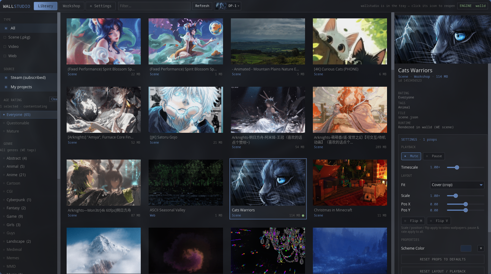
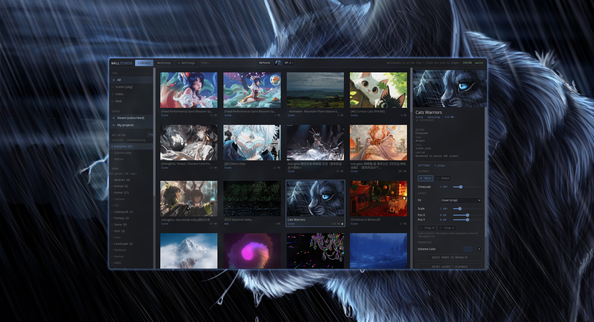

# walld

A wallpaper engine for **Hyprland**, with a native Rust daemon and the
**WallStudio** library browser, player, and scene editor. Browse installed
Wallpaper Engine content, play animated scenes and videos, and derive a desktop
palette from your wallpaper.

## Screenshots





Screenshots show installed Steam Workshop content; wallpaper artwork belongs to
its respective creators and is not included in this repository.

## What it does

1. One background layer-shell surface per monitor (static images)
2. Reloads paths when config changes or themes apply
3. Transitions: `snap` (instant) or `wipe` (GPU diagonal reveal)
4. Coexists with **hyprmotion** for video themes (`stop` / `start` handoff)


## Scenes (wallpaper engine prototype)

Scene documents are JSON (schema v1). Shared crate: `wallengine-scene`.

```bash
# load a scene on all monitors
walld ctl scene '*' ~/.local/share/wallengine/scenes/yozakura-snow/scene.json
walld ctl status   # shows scene=yozakura-snow (animated)

# example scenes ship in examples/scenes/ and install to:
#   ~/.local/share/wallengine/scenes/
```

Layer types so far: `image`, `color`, `particles` (presets: `snow`, `dust`).

Optional in `~/.config/walld/config`:

```
scene = ~/.local/share/wallengine/scenes/yozakura-snow/scene.json
scene_fps = 30
```

Classic `hyprpaper.conf` image mode still works when `scene` is unset.


## wallstudio — the product

**wallstudio + walld** are a self-contained Wallpaper Engine client for Hyprland.
No mpvpaper, no linux-wallpaperengine. Content is rendered **inside walld**.

**Scene editor** (workshop-first): select a Scene wallpaper → **Edit scene** (or `E`) →
forks into `~/.local/share/wallengine/projects/`, opens a second window, live preview
via the same walld pipeline. Edits write WE `scene.json` (package tree, no in-place
Steam writes). Checklist: [`SCENE_EDITOR.md`](./SCENE_EDITOR.md).

Fresh install path:

1. Hyprland + Steam + Wallpaper Engine (for workshop content)
2. Subscribe to wallpapers
3. Install **walld** + **wallstudio**
4. Run `wallstudio` → play

```bash
cargo build --release -p walld -p wallstudio -p wallaccent
install -Dm755 target/release/walld ~/.local/bin/walld
install -Dm755 target/release/wallstudio ~/.local/bin/wallstudio
install -Dm755 target/release/wallaccent ~/.local/bin/wallaccent   # wallpaper-derived desktop palette
walld &          # or wallpaper-boot / systemd
wallstudio
```

`wallaccent` must sit next to `walld` (or on `PATH`) for WallStudio to update
the desktop palette when a wallpaper switches: waybar, Kitty (including text),
KDE/Qt applications such as Dolphin, GTK, Hyprland, notifications and Rofi.

| Type | How walld plays it |
|------|---------------------|
| **Video** | In-engine decode (`ffmpeg` as codec → GL texture) |
| **Scene** | Full WE pipeline: PKGV unpack, TEX (LZ4/ARGB/DXT/RG88/R8), ortho layers, waterflow effect passes, real particle emitters/operators |
| **Web** | Experimental persistent Chromium renderer; see [Web support](WEB_SUPPORT.md) |
| **App** | Not supported |

System deps: **ffmpeg** (video decode), GPU/OpenGL ES. Steam WE for workshop files + optional assets.

IPC:

```bash
walld ctl we '*' ~/.local/share/Steam/steamapps/workshop/content/431960/<id>
walld ctl we_stop
```


## wallstudio (legacy note)

```bash
cargo build -p wallstudio --release
install -Dm755 target/release/wallstudio ~/.local/bin/wallstudio
wallstudio   # gallery + apply scenes via walld IPC
```

Lists `~/.local/share/wallengine/scenes/*`, shows daemon status, Apply → `walld ctl scene`.

## Build / install

```bash
git clone https://github.com/rippelz/walld.git
cd walld
cargo build --release
install -Dm755 target/release/walld ~/.local/bin/walld
```

## Config

| Path | Role |
|------|------|
| `~/.config/walld/config` | Global options (`transition`, `wipe_ms`, …) |
| `~/.config/hypr/hyprpaper.conf` | Per-monitor `wallpaper { … }` blocks (hyprpaper-compatible) |

Example `~/.config/walld/config`:

```
transition = wipe    # snap | wipe
wipe_ms = 480
wipe_feather_px = 80
```

`SIGHUP` reloads wallpaper paths using the configured transition (same as
`walld ctl reload`).

## IPC

Socket: `$XDG_RUNTIME_DIR/walld.sock`

```bash
walld ctl ping
walld ctl status
walld ctl reload
walld ctl set  <monitor|*> <path>   # default transition
walld ctl snap <monitor|*> <path>
walld ctl wipe <monitor|*> <path>
walld ctl preload <path>
walld ctl boot_capture  # force-refresh per-monitor boot stills now
walld ctl stop     # hide surfaces (video handoff)
walld ctl start    # recreate surfaces
walld ctl ready    # ok when every output has a committed frame
walld ctl quit
```

## Boot stills (instant wallpaper on login)

When a wallpaper is applied, walld writes a per-monitor still to
`$XDG_CACHE_HOME/walld/boot/<monitor>.png` (e.g. `DP-1.png`). On the next
start those PNGs paint **before** Wallpaper Engine content loads, so you never
see Hyprland’s default background while the workshop pack spins up.

Stills refresh automatically ~1s after WE has real frames, or on classic
image set, or via `walld ctl boot_capture`.

## Autostart (Hyprland)

This setup uses `exec-once = ~/.local/bin/wallpaper-boot`, which starts **walld**
for static themes and **hyprmotion** for video themes.

Optional user unit (example in-tree):

```bash
mkdir -p ~/.config/systemd/user
cp ~/code/walld/walld.service ~/.config/systemd/user/
systemctl --user daemon-reload
systemctl --user enable --now walld.service
# If you still have hyprpaper enabled:
systemctl --user disable --now hyprpaper.service
```

Do **not** run hyprpaper and walld together for daily use — both paint
background layers.

## Video coexistence (hyprmotion)

- **Static wallpapers** → walld shows images from hyprpaper.conf paths
- **Video wallpapers** → walld **stop** (hide); hyprmotion / mpvpaper runs
- **Back to static** → walld **start** + set/reload path **before** killing video
  (avoids Hyprland default background flash)

## Manual smoke

```bash
# kill legacy static engine if still running
pkill -x hyprpaper || true
walld -v &
walld ctl status
walld ctl wipe DP-1 ~/Pictures/Wallpapers/ember.jpg
```
